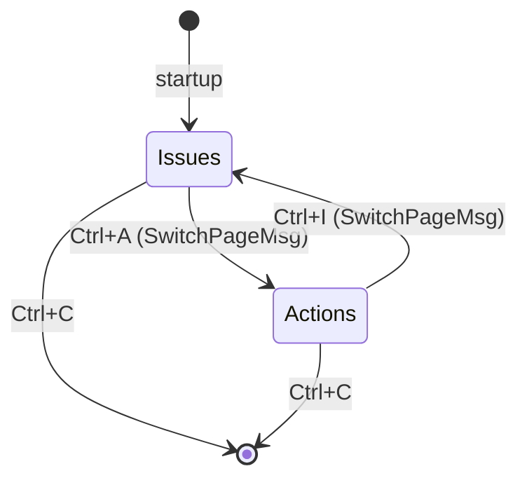
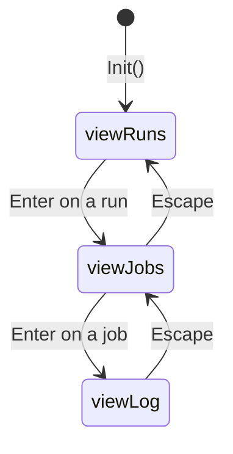

# `ght` Architecture and Developer Reference

**Module:** `github.com/skanehira/ght`
**Go version:** 1.24.2
**Binary name:** `ght`

This document is the definitive technical reference for contributors, reviewers, and anyone working with the `ght` codebase. It covers architectural intent, package boundaries, data-flow mechanics, and step-by-step guides for extending the application.

---

## Table of Contents

1. [High-Level Architecture](#1-high-level-architecture)
2. [Bubble Tea Model Pattern](#2-bubble-tea-model-pattern)
3. [Package Reference](#3-package-reference)
   - [cmd/ght/](#31-cmdght)
   - [config/](#32-config)
   - [github/](#33-github)
   - [domain/](#34-domain)
   - [ui/theme/](#35-uitheme)
   - [ui/components/](#36-uicomponents)
   - [ui/pages/](#37-uipages)
   - [ui/app.go](#38-uiappgo)
4. [Message Types Reference](#4-message-types-reference)
5. [Adding a New Domain Type](#5-adding-a-new-domain-type)
6. [Rate Limiting](#6-rate-limiting)
7. [Key Dependencies](#7-key-dependencies)
8. [Build, Run, and Test](#8-build-run-and-test)

---

## 1. High-Level Architecture

`ght` follows a strict four-layer architecture. Each layer has a single well-defined responsibility, and dependencies flow strictly downward: upper layers depend on lower layers, but lower layers never import upper layers.

```
┌─────────────────────────────────────────────┐
│              GitHub REST API                │
│           GitHub GraphQL API                │
└────────────────────┬────────────────────────┘
                     │ HTTP / OAuth2
┌────────────────────▼────────────────────────┐
│               github/ package               │
│  GraphQL client (shurcooL/githubv4)         │
│  REST client   (google/go-github/v68)       │
│  Shared RateLimiter (token-bucket + sem)    │
│  Query structs, mutation structs            │
│  Converter functions (→ domain types)       │
└────────────────────┬────────────────────────┘
                     │ domain.Item values
┌────────────────────▼────────────────────────┐
│               domain/ package               │
│  Item interface  (Key() + Fields())         │
│  ColorRole semantic color constants         │
│  Concrete types: Issue, Comment, Label,     │
│  AssignableUser, Milestone, Project,        │
│  WorkflowRun, WorkflowJob                   │
└────────────────────┬────────────────────────┘
                     │ typed structs
┌────────────────────▼────────────────────────┐
│                 ui/ package                 │
│  ui/theme/   — Palette + Theme + Resolve()  │
│  ui/components/ — TabBar, StatusBar         │
│  ui/pages/   — IssuesModel, ActionsModel,   │
│                 CreateIssueFormModel         │
│  ui/app.go   — AppModel (root tea.Model)    │
└────────────────────┬────────────────────────┘
                     │ tea.NewProgram()
┌────────────────────▼────────────────────────┐
│              cmd/ght/main.go                │
│  config.Init() → github.NewClient()         │
│  token scope validation → ui.Start()        │
└─────────────────────────────────────────────┘
```

### Data flow narrative

1. `main.go` reads config and constructs the shared HTTP client with an OAuth2 token. It wraps the transport with `RateLimiter.WrapTransport()` before handing the client to both the GraphQL and REST wrappers.
2. When the Bubble Tea event loop starts, `AppModel.Init()` delegates to `IssuesModel.Init()`, which fires a `fetchIssues` command — a Go closure that calls `github.GetIssues()`.
3. `github.GetIssues()` executes a GraphQL query. The response structs in `github/query_issue.go` contain `ToDomain()` methods that convert the raw API types into `domain.Issue` values.
4. The command returns an `IssuesLoadedMsg` carrying `[]domain.Item`. The Bubble Tea runtime delivers this message to `IssuesModel.Update()`, which populates the table and triggers a re-render.
5. `IssuesModel.View()` assembles the full-page string by calling lipgloss layout helpers and rendering sub-components. The terminal sees only the final composed string.

### Page navigation

Two top-level pages exist: `"issues"` and `"actions"`. The `AppModel` tracks `currentPage string` and delegates all `Update`/`View` calls to the active page model.

- `Ctrl+A` (on the Issues page) emits `SwitchPageMsg{Page: "actions"}`, which `AppModel.Update` catches and responds to by calling `m.actions.Init()`.
- `Ctrl+I` (on the Actions page) emits `SwitchPageMsg{Page: "issues"}` and returns the user to the issues view.



---

## 2. Bubble Tea Model Pattern

`ght` uses the [Bubble Tea](https://github.com/charmbracelet/bubbletea) framework, which implements the Elm Architecture: every model is a pure value type with three functions.

```go
type tea.Model interface {
    Init()              tea.Cmd
    Update(tea.Msg)     (tea.Model, tea.Cmd)
    View()              string
}
```

- `Init()` returns the command(s) to run at startup (e.g., spinner tick + first API fetch).
- `Update(msg)` receives a message, produces a new model value (models are immutable structs — methods have value receivers), and optionally returns a follow-up command.
- `View()` renders the current model state to a string. It is called after every `Update`.

### Commands are deferred I/O

A `tea.Cmd` is `func() tea.Msg` — it is executed by the Bubble Tea runtime in a goroutine, then the returned `tea.Msg` is delivered back to `Update`. This is how async operations (API calls, file reads) integrate without callbacks or goroutine management in business logic.

### Concrete message flow: fetching issues

```
IssuesModel.Init()
    └── returns tea.Batch(spinner.Tick, fetchIssues("", nil))

fetchIssues("", nil)          [executed in goroutine by bubbletea runtime]
    └── calls github.GetIssues(variables)
    └── converts result to []domain.Item
    └── returns IssuesLoadedMsg{Items: [...], PageInfo: &pi}

IssuesModel.Update(IssuesLoadedMsg)
    └── m.loading = false
    └── m.issues = msg.Items
    └── m.applyPageInfo(msg.PageInfo)
    └── m.rebuildIssueTable()
    └── m.updateDetailsAndPreview(0)
    └── returns updated model, nil command

IssuesModel.View()
    └── renders panels with populated table
```

### Pagination: loading more issues

When the user presses `f` on the issues table, if `m.hasMore && m.cursor != nil`, the model dispatches `fetchMoreIssues(m.query, m.cursor)`, which returns `IssuesMoreLoadedMsg`. That message appends to `m.issues` rather than replacing it, enabling progressive load.

### Window resize

`tea.WindowSizeMsg` is broadcast to all models regardless of which page is active. `AppModel.Update` forwards it to both `IssuesModel` and `ActionsModel` simultaneously via `tea.Batch`, so both keep accurate layout dimensions even when hidden.

---

## 3. Package Reference

### 3.1 `cmd/ght/`

**File:** `/Users/beckett/Projects/github_clones/github-tui/cmd/ght/main.go`

The entry point. Responsibilities:

1. Call `config.Init()` to load `config.yaml` (or run the first-run wizard).
2. Detect the repository context by parsing `owner/repo` from command-line arguments or from `git remote get-url origin`.
3. Instantiate all GitHub API clients via `github.NewClient(token)`.
4. Validate the token's OAuth scopes against GitHub's `/user` endpoint with a 10-second timeout.
5. Call `ui.Start()` to hand control to the Bubble Tea event loop.

**Remote parsing** supports three URL formats:
- SSH: `ssh://git@github.com/owner/repo`
- Git protocol: `git@github.com:owner/repo.git`
- HTTPS: `https://github.com/owner/repo.git`

```go
// Startup sequence
config.Init()
getRepoInfo()                         // sets config.GitHub.Owner / .Repo
github.NewClient(config.GitHub.Token) // constructs shared HTTP client
scopes, _ := github.ValidateTokenScopes(ctx, token)
scopes.Validate()                     // fatal if classic PAT and missing scopes
ui.Start()                            // blocks until Ctrl+C or quit
```

### 3.2 `config/`

**File:** `/Users/beckett/Projects/github_clones/github-tui/config/config.go`

The config package manages one YAML file stored in the OS config directory.

**Config file location:** `$XDG_CONFIG_HOME/ght/config.yaml` on Linux, `~/Library/Application Support/ght/config.yaml` on macOS, or `%AppData%\ght\config.yaml` on Windows. The exact directory is determined by `os.UserConfigDir()`.

**Config file format:**

```yaml
github:
  token: ghp_your_personal_access_token_here
```

**First-run behavior:** If the config file does not exist, `config.Init()` enters an interactive wizard that prompts for a GitHub PAT on stderr, then writes `config.yaml` with `0600` permissions (owner-read-only).

**Exported package-level variables:**

```go
var GitHub github  // .Owner string, .Repo string, .Token string
var App    app     // .File string (path to config.yaml)
```

`Owner` and `Repo` are not persisted; they are set by `cmd/ght/main.go` at startup from CLI args or git remote detection.

**Debug log:** `config.Init()` also creates `$configDir/ght/debug.log` and redirects `log` output to it (plus stderr), so all `log.Printf` calls throughout the codebase go to this file.

### 3.3 `github/`

The `github` package is the sole point of contact with the GitHub API. It exposes Go functions with clean signatures; callers never deal with raw HTTP or GraphQL details.

#### Client initialization

**File:** `/Users/beckett/Projects/github_clones/github-tui/github/client.go`

```go
func NewClient(token string) {
    src := oauth2.StaticTokenSource(&oauth2.Token{AccessToken: token})
    httpClient := oauth2.NewClient(context.Background(), src)

    rateLimiter = NewRateLimiter()
    httpClient.Transport = rateLimiter.WrapTransport(httpClient.Transport)

    graphQLClient = githubv4.NewClient(httpClient)
    restClient    = gogithub.NewClient(httpClient)
}
```

Both clients share a single `*http.Client`, so the rate limiter middleware applies to all outgoing requests regardless of which API they target.

#### GraphQL client (`shurcooL/githubv4`)

Query structs use struct tags to describe the GraphQL shape. The library reflects on the struct to construct the query string at runtime. Scalar types use `githubv4.String`, `githubv4.Int`, `githubv4.Boolean`, etc.

```go
// Excerpt from github/query_issue.go
type Issue struct {
    ID     githubv4.String
    Number githubv4.Int
    Title  githubv4.String
    Labels Labels `graphql:"labels(first: 10)"`
    Comments struct {
        Nodes []Comment
    } `graphql:"comments(first: 100)"`
    // ...
}
```

Pagination uses GraphQL cursor-based pagination, normalized to the shared `PageInfo` struct:

```go
// github/query.go
type PageInfo struct {
    EndCursor   githubv4.String
    HasNextPage githubv4.Boolean
}
```

#### REST client (`google/go-github/v68`)

Used exclusively for GitHub Actions. The REST API uses page-number pagination. The `fetchRuns` command in `ui/pages/actions.go` converts the integer page number to a string and stores it as the `EndCursor` to reuse the shared `PageInfo` abstraction.

#### Key functions

| Function | File | Description |
|---|---|---|
| `GetIssues(variables)` | `client.go` | GraphQL issue search with cursor pagination |
| `GetIssue(variables)` | `client.go` | Fetch single issue by number |
| `GetIssueTemplates(variables)` | `client.go` | Fetch repo issue templates |
| `CreateIssue(input)` | `client.go` | GraphQL mutation to open an issue |
| `UpdateIssue(input)` | `client.go` | GraphQL mutation to update issue fields |
| `CloseIssue(id)` | `client.go` | GraphQL mutation to close an issue |
| `ReopenIssue(id)` | `client.go` | GraphQL mutation to reopen an issue |
| `AddIssueComment(input)` | `client.go` | GraphQL mutation to add a comment |
| `UpdateIssueComment(input)` | `client.go` | GraphQL mutation to edit a comment |
| `DeleteIssueComment(id)` | `client.go` | GraphQL mutation to delete a comment |
| `GetRepoLabels(variables)` | `client.go` | Fetch repo labels with pagination |
| `GetRepoMillestones(variables)` | `client.go` | Fetch repo milestones |
| `GetRepoProjects(variables)` | `client.go` | Fetch repo classic projects |
| `GetRepoAssignableUsers(variables)` | `client.go` | Fetch users who can be assigned |
| `ListWorkflowRuns(ctx, owner, repo, opts)` | `actions.go` | List all workflow runs (REST) |
| `ListWorkflowRunsByWorkflowID(...)` | `actions.go` | Filter runs by workflow ID (REST) |
| `ListWorkflows(ctx, owner, repo)` | `actions.go` | List all workflows with full pagination |
| `ListWorkflowJobs(ctx, owner, repo, runID, opts)` | `actions.go` | List jobs for a run |
| `GetWorkflowJobLog(ctx, owner, repo, jobID)` | `actions.go` | Download and clean a job log |
| `ValidateTokenScopes(ctx, token)` | `token_validator.go` | Check PAT scopes via `/user` endpoint |

#### Log cleaning

`GetWorkflowJobLog` downloads the raw log, caps it at 10 MB using `io.LimitReader`, and then calls `CleanLog` which strips two patterns:

1. ANSI escape sequences: `\x1b\[[0-9;]*[a-zA-Z]`
2. GitHub Actions timestamp prefixes: `2024-01-15T10:30:45.1234567Z ` (via regex)

The function returns the cleaned string, a `truncated bool` indicating whether the 10 MB cap was hit, and any error.

#### Mutation structs

GraphQL mutations follow the same struct-tag pattern as queries. Each mutation has a dedicated type in `github/mutation_issue.go` or `github/mutation_comment.go`:

```go
type MutateCreateIssue struct {
    CreateIssue struct {
        Issue struct{ ID githubv4.String }
    } `graphql:"createIssue(input: $input)"`
}
```

### 3.4 `domain/`

The `domain` package defines the shared data model. It has no dependencies on `github/` or `ui/` — it sits between them, enabling both to work in terms of the same types without circular imports.

#### The `Item` interface

**File:** `/Users/beckett/Projects/github_clones/github-tui/domain/item.go`

```go
type Item interface {
    Key() string
    Fields() []Field
}

type Field struct {
    Text      string
    ColorRole ColorRole
}
```

Every displayable entity implements `Item`. The `Key()` method returns a stable unique identifier (usually the API-level ID or a formatted string). `Fields()` returns an ordered slice of `Field` values — one per column or display segment — each carrying its text and a semantic `ColorRole`.

#### `ColorRole` — semantic color constants

`ColorRole` is a string type, not a tcell color or lipgloss color. This is a deliberate indirection: domain types describe intent ("this text is a warning") without coupling to any specific terminal color system. The `ui/theme` layer resolves roles to concrete `lipgloss.Color` values.

```go
const (
    ColorRoleDefault ColorRole = "default"  // body text
    ColorRoleMuted   ColorRole = "muted"    // secondary/dimmed text
    ColorRoleAccent  ColorRole = "accent"   // links, highlights (#58a6ff)
    ColorRoleSuccess ColorRole = "success"  // open issues, success (#3fb950)
    ColorRoleDanger  ColorRole = "danger"   // closed issues, failure (#f85149)
    ColorRoleWarning ColorRole = "warning"  // author names, in-progress (#d29922)
)
```

#### Concrete domain types

| Type | File | `Key()` | `Fields()` columns | Notes |
|---|---|---|---|---|
| `Issue` | `issue.go` | GraphQL node ID | repo/owner, number, state, author, title | State drives `ColorRoleSuccess`/`ColorRoleDanger` |
| `Comment` | `comment.go` | GraphQL node ID | author, updatedAt | Body field stored but not in `Fields()` — accessed by type assertion |
| `Label` | `label.go` | label name | name | |
| `AssignableUser` | `assignees.go` | login string | login | |
| `Milestone` | `milestone.go` | title | title | |
| `Project` | `project.go` | name | name | |
| `WorkflowRun` | `workflow_run.go` | `fmt.Sprintf("%d", ID)` | status, name, branch, event, duration | `statusDisplay()` maps status+conclusion to text+role |
| `WorkflowJob` | `workflow_job.go` | `fmt.Sprintf("%d", ID)` | status, name, duration | Reuses `statusDisplay()` from `workflow_run.go` |

**Important detail about `Comment.Body`:** The `Fields()` method on `Comment` returns only `Author` and `UpdatedAt` — the two columns shown in the comments table. The `Body` field (markdown content rendered in the preview pane) is accessed by type-asserting the `domain.Item` to `*domain.Comment` in `IssuesModel.updateCommentPreview`. This pattern — where `Fields()` covers display columns but full data lives in the concrete struct — is the standard approach in this codebase.

#### `github/` query structs vs `domain/` types

The `github/` package has its own parallel set of structs (e.g., `github.Issue`, `github.Comment`) that mirror the GraphQL schema. These have `ToDomain()` methods that convert them to domain types. This two-layer approach means the GraphQL schema shape is isolated in `github/`, and the rest of the application works only with clean domain types.

```go
// github/query_issue.go
func (i *Issue) ToDomain() *domain.Issue {
    return &domain.Issue{
        ID:     string(i.ID),
        Number: strconv.Itoa(int(i.Number)),
        State:  string(i.State),
        // ...
    }
}
```

### 3.5 `ui/theme/`

**File:** `/Users/beckett/Projects/github_clones/github-tui/ui/theme/theme.go`

The theme layer translates semantic color roles and structural intent (panel, header, status bar, etc.) into concrete `lipgloss.Style` values. There is one theme: the GitHub dark palette. All UI components receive a `Theme` value at construction time and hold it for the lifetime of the application.

#### `Palette`

Raw hex color constants organized by semantic purpose:

```go
var Palette = struct {
    Background  string // "#0d1117" — deepest background
    Surface     string // "#161b22" — panel/bar background
    Border      string // "#30363d" — unfocused panel border
    BorderFocus string // "#58a6ff" — focused panel border (accent blue)
    Text        string // "#e6edf3" — primary text
    TextMuted   string // "#7d8590" — secondary/dimmed text
    Success     string // "#3fb950" — green
    Danger      string // "#f85149" — red
    Warning     string // "#d29922" — amber
    Accent      string // "#58a6ff" — blue accent (links, focus)
}{ /* ... */ }
```

#### `Theme` struct

Pre-built `lipgloss.Style` values so that rendering code never calls `lipgloss.NewStyle()` directly:

```go
type Theme struct {
    Text    lipgloss.Style  // primary foreground
    Muted   lipgloss.Style  // secondary foreground
    Accent  lipgloss.Style  // accent blue
    Success lipgloss.Style
    Danger  lipgloss.Style
    Warning lipgloss.Style

    Panel        lipgloss.Style  // rounded border, unfocused
    PanelFocused lipgloss.Style  // rounded border, accent border color

    TableHeader   lipgloss.Style  // bold, muted foreground
    TableSelected lipgloss.Style  // inverted background for highlighted row

    TabActive   lipgloss.Style   // accent + bold
    TabInactive lipgloss.Style   // muted

    StatusBar lipgloss.Style     // surface background + muted text + padding
    TitleBar  lipgloss.Style     // surface background + primary text + bold
}
```

#### `Theme.Resolve(ColorRole) lipgloss.Color`

Maps a domain `ColorRole` to a `lipgloss.Color`. This is the bridge between the domain layer's semantic intent and the UI layer's concrete rendering:

```go
func (th Theme) Resolve(role domain.ColorRole) lipgloss.Color {
    switch role {
    case domain.ColorRoleSuccess: return lipgloss.Color(Palette.Success)
    case domain.ColorRoleDanger:  return lipgloss.Color(Palette.Danger)
    // ...
    default:                      return lipgloss.Color(Palette.Text)
    }
}
```

#### `Theme.StyleField(text string, role ColorRole) string`

Convenience method that combines `Resolve` and `Render` into a single call for field-level inline styling.

### 3.6 `ui/components/`

Stateless rendering helpers that take data and return styled strings. They hold a `Theme` but no mutable state.

#### `TabBar`

**File:** `/Users/beckett/Projects/github_clones/github-tui/ui/components/tabbar.go`

Renders the persistent tab row shown at the top of every page: `● Issues    ○ Actions`.

```go
func (tb TabBar) View(activePage string) string
```

The active tab uses `th.TabActive` (accent + bold) with a filled circle indicator `●`. The inactive tab uses `th.TabInactive` (muted) with an empty circle `○`. The two tabs are joined horizontally with four spaces of padding between them.

#### `StatusBar`

**File:** `/Users/beckett/Projects/github_clones/github-tui/ui/components/statusbar.go`

Renders the bottom bar that shows key hints on the left and a context string on the right.

```go
type KeyHint struct {
    Key  string
    Desc string
}

func (sb StatusBar) View(width int, hints []KeyHint, context string) string
```

Key labels are styled with `th.Accent`; descriptions with `th.Muted`. The gap between the left-aligned hints and the right-aligned context string is computed using `lipgloss.Width()` (which strips ANSI codes) to ensure correct alignment regardless of terminal color support.

### 3.7 `ui/pages/`

Each page model is a self-contained `tea.Model`. Pages own their sub-components and communicate with `AppModel` only through message types defined in the `pages` package.

#### `IssuesModel`

**File:** `/Users/beckett/Projects/github_clones/github-tui/ui/pages/issues.go`

The issues page implements a multi-panel layout with six focusable regions:

```
focusFilter         — textinput for GitHub search query
focusIssues         — issues table (bubbles/table)
focusDetails        — viewport: labels, assignees, milestone, projects
focusComments       — comments table
focusIssuePreview   — viewport: issue body rendered as markdown (glamour)
focusCommentPreview — viewport: comment body rendered as markdown
```

Focus cycles through these regions in order via `Ctrl+N` (next) and `Ctrl+P` (previous). The `focusPanels` slice defines the cycle order:

```go
var focusPanels = []focusedPanel{
    focusFilter, focusIssues, focusDetails,
    focusComments, focusIssuePreview, focusCommentPreview,
}
```

**Layout proportions** (computed in `recalcLayout()`):

```
Top row    (60% of content height):
  Details panel   20% width
  Issues table    45% width
  Issue preview   35% width (remainder)

Bottom row (40% of content height):
  Comments table    55% width
  Comment preview   45% width (remainder)

Reserved rows: title(1) + tabbar(1) + divider(1) + filter(3) + statusbar(1) = 7
```

**Markdown rendering:** `IssuesModel` caches a `*glamour.TermRenderer` and recreates it only when the preview pane width changes. This avoids expensive allocations on every cursor movement while ensuring the rendered output wraps correctly at the current terminal width.

**Issue search query:** The filter input is pre-populated with `repo:owner/repo state:open` as a placeholder. When the user submits a search (Enter while `focusFilter` is active), `ensureIsIssue()` prepends `"is:issue"` to prevent the GitHub search API from returning pull requests alongside issues.

**Key bindings (IssuesModel):**

| Key | Scope | Action |
|---|---|---|
| `Ctrl+A` | Global | Switch to Actions page |
| `Ctrl+N` | Global | Focus next panel |
| `Ctrl+P` | Global | Focus previous panel |
| `Enter` | Filter focused | Submit search query |
| `f` | Issues table focused | Fetch next page of results |
| `Ctrl+C` | Global | Quit |
| Arrow keys / `j`/`k` | Tables focused | Navigate rows |

#### `ActionsModel`

**File:** `/Users/beckett/Projects/github_clones/github-tui/ui/pages/actions.go`

The Actions page is a three-state machine:



Each state renders a different sub-component:
- `viewRuns` — `runsTable` (bubbles/table), columns: Status, Workflow, Branch, Event, Duration
- `viewJobs` — `jobsTable` (bubbles/table), columns: Status, Job, Duration
- `viewLog` — `logView` (bubbles/viewport), plain text log content

The `statusBar.View()` call passes different `[]KeyHint` and context strings for each view state, so the bottom bar always reflects what keys are available.

**Status filter cycling:** On the runs view, pressing `s` cycles through `statusFilterCycle = ["", "success", "failure", "in_progress", "queued"]`. An empty string fetches all runs. The current filter is displayed in the status bar context string.

**Key bindings (ActionsModel):**

| Key | View | Action |
|---|---|---|
| `Ctrl+I` | Any | Switch to Issues page |
| `Enter` | Runs | Drill into jobs for selected run |
| `Enter` | Jobs | Load log for selected job |
| `Escape` | Jobs | Return to runs view |
| `Escape` | Log | Return to jobs view |
| `s` | Runs | Cycle status filter |
| `r` | Runs / Jobs | Refresh current list |
| `Ctrl+C` | Any | Quit |

#### `CreateIssueFormModel`

**File:** `/Users/beckett/Projects/github_clones/github-tui/ui/pages/form.go`

A five-field form for creating issues. Fields (in tab order):

1. `Title` (required for submission)
2. `Assignees` (comma-separated; currently passed to API as display only — full multi-value support is a future enhancement)
3. `Labels` (comma-separated)
4. `Projects`
5. `Milestone`

The form fetches the repository's node ID (`repoID`) asynchronously on `Init()` using `fetchRepoID`. The `CreateIssue` GraphQL mutation requires a `RepositoryID`, so submission is blocked until this async fetch completes.

Submission is triggered by pressing `Enter` when `title != ""` and `repoID != nil`. On success, the form emits `IssueCreatedMsg{}`. On `Escape`, it emits `FormDismissedMsg{}`.

**Note:** `CreateIssueFormModel` is constructed and managed by `IssuesModel` rather than being wired into `AppModel` directly. It is presented as an overlay when the user presses `n` in the issues view.

#### Shared helper: `newTable(th)`

```go
func newTable(th theme.Theme) table.Model {
    s := table.DefaultStyles()
    s.Header = th.TableHeader
    s.Selected = th.TableSelected
    t := table.New(table.WithStyles(s), table.WithFocused(false))
    return t
}
```

All tables in the application are constructed with this helper, ensuring consistent themed header and selection styles.

#### `panelStyle(focused bool, width int) lipgloss.Style`

Returns a rounded-border lipgloss style sized to `width`. When `focused` is true, the border uses `Palette.BorderFocus` (accent blue); otherwise `Palette.Border` (dim gray). This function is called in `IssuesModel.renderPanels()` for each of the six panels.

### 3.8 `ui/app.go`

**File:** `/Users/beckett/Projects/github_clones/github-tui/ui/app.go`

`AppModel` is the root Bubble Tea model. It owns the two page models and routes messages between them.

```go
type AppModel struct {
    th          theme.Theme
    currentPage string       // "issues" or "actions"
    issues      pages.IssuesModel
    actions     pages.ActionsModel
    width       int
    height      int
}
```

**`AppModel.Update` routing logic:**

```
tea.WindowSizeMsg   → forwarded to BOTH pages (via tea.Batch)
pages.SwitchPageMsg → update currentPage; call actions.Init() if switching to actions
tea.KeyMsg (Ctrl+C) → tea.Quit
all other messages  → forwarded to the active page only
```

**`AppModel.View`** simply delegates to `m.issues.View()` or `m.actions.View()` based on `currentPage`.

**`Start()`** creates the Bubble Tea program with `tea.WithAltScreen()`, which switches to the terminal's alternate screen buffer on startup and restores it on exit — a standard TUI practice that avoids polluting the user's scrollback history.

---

## 4. Message Types Reference

All message types are defined in the `ui/pages` package. They are unexported (lowercase) for internal coordination or exported (uppercase) for cross-model communication.

| Type | Kind | Defined in | Produced by | Consumed by |
|---|---|---|---|---|
| `IssuesLoadedMsg` | exported | `pages/issues.go` | `fetchIssues` cmd | `IssuesModel.Update` |
| `IssuesMoreLoadedMsg` | exported | `pages/issues.go` | `fetchMoreIssues` cmd | `IssuesModel.Update` |
| `CommentsLoadedMsg` | exported | `pages/issues.go` | (reserved — not yet used) | `IssuesModel.Update` |
| `SwitchPageMsg` | exported | `pages/issues.go` | key handlers in both pages | `AppModel.Update` |
| `RunsLoadedMsg` | exported | `pages/actions.go` | `fetchRuns` cmd | `ActionsModel.Update` |
| `JobsLoadedMsg` | exported | `pages/actions.go` | `fetchJobs` cmd | `ActionsModel.Update` |
| `LogLoadedMsg` | exported | `pages/actions.go` | `fetchLog` cmd | `ActionsModel.Update` |
| `IssueCreatedMsg` | exported | `pages/form.go` | `submitIssue` cmd | `CreateIssueFormModel.Update` |
| `FormDismissedMsg` | exported | `pages/form.go` | Escape key | parent model |
| `repoIDLoadedMsg` | unexported | `pages/form.go` | `fetchRepoID` cmd | `CreateIssueFormModel.Update` |
| `issueSubmitErrMsg` | unexported | `pages/form.go` | `submitIssue` cmd (on error) | `CreateIssueFormModel.Update` |

**Design note:** `CommentsLoadedMsg` is defined and handled but currently unused because comments are embedded in the `Issue` GraphQL node at fetch time (up to 100 per issue, via `comments(first: 100)`). If comment pagination becomes necessary, this message type provides the integration point.

---

## 5. Adding a New Domain Type

This is the canonical procedure for adding support for a new GitHub entity (e.g., pull requests, releases, milestones with richer data).

### Step 1: Define the domain type

Create a new file in `domain/`. Implement the `Item` interface.

```go
// domain/pull_request.go
package domain

import "fmt"

type PullRequest struct {
    ID     string
    Number string
    State  string
    Title  string
    Author string
    // add all fields you need
}

func (pr *PullRequest) Key() string {
    return pr.ID
}

func (pr *PullRequest) Fields() []Field {
    stateRole := ColorRoleSuccess
    if pr.State == "MERGED" {
        stateRole = ColorRoleAccent
    } else if pr.State == "CLOSED" {
        stateRole = ColorRoleDanger
    }
    return []Field{
        {Text: pr.Number, ColorRole: ColorRoleAccent},
        {Text: pr.State,  ColorRole: stateRole},
        {Text: pr.Author, ColorRole: ColorRoleWarning},
        {Text: pr.Title,  ColorRole: ColorRoleDefault},
    }
}
```

Choose `ColorRole` values based on semantic meaning:
- Identifiers / links: `ColorRoleAccent`
- Status (success): `ColorRoleSuccess`
- Status (error/closed): `ColorRoleDanger`
- Status (in-progress): `ColorRoleWarning`
- Author names: `ColorRoleWarning`
- Secondary info: `ColorRoleMuted`
- Body text: `ColorRoleDefault`

### Step 2: Add the GitHub API call

For GraphQL, add a query struct in `github/` with `graphql:"..."` tags. Add a `ToDomain()` method. Add a public function to `github/client.go`.

```go
// github/query_pull_request.go
package github

import (
    "strconv"
    "github.com/shurcooL/githubv4"
    "github.com/skanehira/ght/domain"
)

type PullRequest struct {
    ID     githubv4.String
    Number githubv4.Int
    State  githubv4.String
    Title  githubv4.String
    Author struct {
        Login githubv4.String
    }
}

func (pr *PullRequest) ToDomain() *domain.PullRequest {
    return &domain.PullRequest{
        ID:     string(pr.ID),
        Number: strconv.Itoa(int(pr.Number)),
        State:  string(pr.State),
        Title:  string(pr.Title),
        Author: string(pr.Author.Login),
    }
}

type PullRequests struct {
    Nodes    []PullRequest
    PageInfo PageInfo
}
```

Add the query function to `github/client.go`:

```go
func GetPullRequests(variables map[string]interface{}) (*PullRequests, error) {
    var q struct {
        Repository struct {
            PullRequests `graphql:"pullRequests(first: $first, after: $cursor, states: [OPEN])"`
        } `graphql:"repository(owner: $owner, name: $name)"`
    }
    if err := graphQLClient.Query(context.Background(), &q, variables); err != nil {
        return nil, err
    }
    return &q.Repository.PullRequests, nil
}
```

### Step 3: Define message types

In `ui/pages/`, define the async message type that the fetch command will return:

```go
type PRsLoadedMsg struct {
    Items    []domain.Item
    PageInfo *github.PageInfo
    Err      error
}
```

### Step 4: Create the page model

Create `ui/pages/prs.go` following the `IssuesModel` or `ActionsModel` pattern. At minimum:

```go
type PRsModel struct {
    th        theme.Theme
    statusBar components.StatusBar
    tabBar    components.TabBar
    width     int
    height    int
    loading   bool
    prs       []domain.Item
    cursor    *string
    hasMore   bool
    prsTable  table.Model
    sp        spinner.Model
}

func (m PRsModel) Init() tea.Cmd {
    return tea.Batch(m.sp.Tick, fetchPRs(nil))
}

func (m PRsModel) Update(msg tea.Msg) (tea.Model, tea.Cmd) { /* ... */ }
func (m PRsModel) View() string { /* ... */ }
```

### Step 5: Wire into `AppModel`

Add a new page constant and model field, then update routing:

```go
// ui/app.go
type AppModel struct {
    // ... existing fields ...
    prs     pages.PRsModel
}

// In Update:
case pages.SwitchPageMsg:
    m.currentPage = msg.Page
    switch msg.Page {
    case "actions":
        return m, m.actions.Init()
    case "prs":
        return m, m.prs.Init()
    }

// In View:
case "prs":
    return m.prs.View()
```

Add the tab to `TabBar.View()` and define the key binding that emits `SwitchPageMsg{Page: "prs"}`.

---

## 6. Rate Limiting

**File:** `/Users/beckett/Projects/github_clones/github-tui/github/rate_limiter.go`

The `RateLimiter` is a middleware layer inserted into the shared `*http.Client` transport. It applies two independent mechanisms:

### Concurrency semaphore

```go
concurrentSem: make(chan struct{}, maxConcurrentRequests) // capacity = 90
```

Before any request proceeds, it must acquire a slot from the buffered channel:

```go
t.rl.concurrentSem <- struct{}{}         // acquire (blocks if full)
defer func() { <-t.rl.concurrentSem }()  // release on return
```

This enforces a hard cap of 90 concurrent in-flight requests, staying below GitHub's documented limit of 100.

### Token bucket rate limiters

Two independent `golang.org/x/time/rate.Limiter` instances — one for REST, one for GraphQL — each initialized with:

```go
rate.NewLimiter(rate.Limit(1.39), 10)
// 1.39 tokens/second ≈ 5,000 tokens/hour
// burst of 10 tokens allows short spikes without blocking
```

The `isGraphQLRequest` function distinguishes the two API types by checking `method == POST && path == "/graphql"`. All other requests use the REST limiter.

### Response header parsing

After each non-GraphQL response, `parseRESTHeaders` reads the GitHub standard rate-limit headers:

- `X-RateLimit-Limit` → `rl.restLimit`
- `X-RateLimit-Remaining` → `rl.restRemaining`
- `X-RateLimit-Reset` → `rl.restResetAt` (Unix timestamp)

These are stored under a `sync.RWMutex` and accessible via `GetRESTStats()` and `IsApproachingLimit(threshold float64)`.

### Full request lifecycle

```
rateLimitTransport.RoundTrip(req)
    1. concurrentSem <- struct{}{}     [blocks if 90 in-flight]
    2. choose limiter (REST or GraphQL)
    3. limiter.Wait(req.Context())     [blocks until token available; respects context cancel]
    4. base.RoundTrip(req)             [actual HTTP call]
    5. parseRESTHeaders(resp)          [update rate limit state from headers]
    6. <-concurrentSem                 [release slot]
    7. return resp
```

Because the `RateLimiter` is wired at the transport level, both `githubv4.Client` and `gogithub.Client` share the same instance without either needing to be aware of rate limiting.

---

## 7. Key Dependencies

| Dependency | Version | Purpose |
|---|---|---|
| `charmbracelet/bubbletea` | v1.3.10 | TUI event loop, Elm Architecture for Go |
| `charmbracelet/lipgloss` | v1.1.0 | Terminal styling, layout helpers |
| `charmbracelet/bubbles` | v1.0.0 | table, viewport, textinput, spinner components |
| `charmbracelet/glamour` | v0.9.1 | Markdown-to-ANSI rendering for preview panes |
| `shurcooL/githubv4` | v0.0.0-20200928... | GitHub GraphQL API client |
| `google/go-github/v68` | v68.0.0 | GitHub REST API client |
| `goccy/go-yaml` | v1.8.3 | Config file parsing |
| `golang.org/x/oauth2` | v0.0.0-20200902... | OAuth2 HTTP transport for token auth |
| `golang.org/x/time` | v0.0.0-20191024... | `rate.Limiter` used in `RateLimiter` |

### Note on lipgloss version pinning

`lipgloss` is pinned to `v1.1.0` rather than tracking the latest release. This is intentional: running `go get github.com/charmbracelet/lipgloss@latest` at the time the project was structured would have resolved to an unstable pre-release pseudo-version. `glamour v0.9.1` is tested against `lipgloss v1.1.0`. If you upgrade lipgloss, verify that glamour's markdown rendering output is not broken, particularly around word-wrap and padding behavior.

### Note on `shurcooL/githubv4`

The pinned commit (`20200928`) predates GitHub's GraphQL schema evolution in some areas (notably `projectsV2`). The `projects` field used in queries targets the classic Projects API, not Projects (Beta) / Projects v2. If you need to add Projects v2 support, you will need to update the githubv4 dependency and add new query structs.

---

## 8. Build, Run, and Test

### Building

```bash
# Build the binary
go build ./cmd/ght

# Install globally (places binary in $GOPATH/bin)
go install ./cmd/ght
```

### Running

```bash
# Auto-detect repo from current directory's git remote
./ght

# Target a specific repository
./ght skanehira/github-tui

# The two forms supported by parseRemote:
# SSH:   git@github.com:owner/repo.git
# HTTPS: https://github.com/owner/repo.git
```

### First run

If `~/.config/ght/config.yaml` (or OS equivalent) does not exist, the application will prompt interactively:

```
Welcome to ght! No config file found.
You need a GitHub Personal Access Token (classic) with repo, workflow, and read:org scopes.
Create one at: https://github.com/settings/tokens

Enter your GitHub token: ghp_...
```

The token is written to `config.yaml` with `0600` permissions and the application continues.

### Required token scopes (classic PAT)

| Scope | Why needed |
|---|---|
| `repo` | Read issues, comments, labels, milestones, projects; read workflow runs and logs |
| `workflow` | Trigger and view workflow runs |
| `read:org` or `project` | Read organization-level projects |

Fine-grained PATs are detected (absence of `X-OAuth-Scopes` header) and allowed with a warning. If you encounter permission errors with a fine-grained PAT, verify that it has read access to repository contents, issues, and actions.

### Testing

```bash
# Run all tests
go test ./...

# Run tests for a specific package
go test ./github/

# Run a single named test
go test ./github/ -run TestRateLimiter

# Run with verbose output
go test -v ./github/

# Run with race detector
go test -race ./...
```

Test files present:
- `github/rate_limiter_test.go` — unit tests for the `RateLimiter` mechanism
- `github/token_validator_test.go` — unit tests using `httptest.Server` for scope parsing
- `github/actions_test.go` — unit tests for log cleaning and converter functions
- `domain/item_test.go` — tests for `Item` interface implementations
- `ui/pages/issues_test.go` — model behavior tests for `IssuesModel`
- `ui/pages/actions_test.go` — model behavior tests for `ActionsModel`
- `ui/pages/form_test.go` — model behavior tests for `CreateIssueFormModel`

### Debug logging

All `log.Printf` / `log.Fatal` output goes to:
- `$configDir/ght/debug.log` (persisted)
- stderr (also shown in terminal if running without alt-screen redirect)

To tail the debug log while running:

```bash
tail -f ~/.config/ght/debug.log   # Linux / macOS XDG
# or
tail -f ~/Library/Application\ Support/ght/debug.log  # macOS default
```
